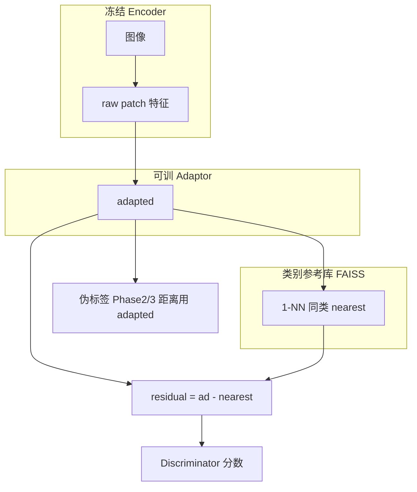

# 迭代式双库设计说明（Adapter 参考库 + 伪标签 Memory Bank）

本文档总结 [`self_train_ad_multiclass_adapter_ref.py`](self_train_ad_multiclass_adapter_ref.py) 中与 **内存库 / 迭代更新** 相关的思路，便于迁移到其他训练脚本。

---

## 1. 核心：两套库，职责不同

实现里存在 **两个独立概念**，不要混用：

| 名称 | 作用 | 存什么向量 | 检索方式 | 是否随训练变化 |
|------|------|------------|----------|----------------|
| **类别参考库（Reference Bank）** | 定义「正常」在 **adapter 空间** 的模板；用于算 **残差** `adapted − nearest` | 每类若干条 **adapter 后** 的 patch 特征（numpy + FAISS） | **按图像类别**：只在同类参考里做 1-NN（L2） | **应随 `adaptor` 权重更新**（见第 4 节） |
| **伪标签 Memory Bank** | 估计「当前模型认为的正常流形」；用于 **patch 级距离图**、不确定区域、（可选）合成异常 | Phase 2 从 **低分正常样本** 收集的 **adapter 特征**（不含减参考） | **全局** FAISS，`k` 近邻距离（与类别无关的单一索引） | **每个 epoch** 在 `precompute` 里重建 |

二者 **空间一致**：都与当前 `localnet.adaptor` 输出同维度；但 **语义不同**：

- 参考库：人工/规则选定的 **干净参考图** → 表达「类条件正常原型」。
- 伪标签库：从当前训练集里筛出的 **模型认为更正常** 的样本 → 表达「自举的正常流形」，用于伪标签与不确定性。

---

## 2. 前向与特征流（与残差脚本对比）

### 2.1 本脚本（adapter 参考 + 判别器吃残差）

要点：

1. **`adaptor` 的输入** 是 **encoder 原始 patch 特征**，不是「先减参考再 adapter」。
2. **判别器** 的输入是 **adapter 空间残差**：`residual = adapted − nearest_ref`（`nearest` 与 query 同形 `[B, P, C]`，按 patch 对齐）。
3. **伪标签 memory bank** 里 **只存 `adapted`**，不存 `residual`（避免与参考库语义重复、且与距离度量一致）。

### 2.2 旧版 `self_train_ad_multiclass_residual.py`（encoder 参考）

- 参考库在 **encoder 空间** 构建，**不依赖 adaptor**，训练过程中参考向量 **固定**。
- `localnet` 整段输入是 **encoder 残差**（等价于 adaptor 在学「残差上的映射」），与本文档的 **adapter 参考** 几何不同。

迁移到其他代码时，先明确：参考向量与 **哪一层** 对齐（encoder / adapter / 融合后），再决定 **多久重建一次**。

---

## 3. 类别参考库的构建细节

### 3.1 参考图像来源

- 按 **类别** 从训练集选 `num_reference_images_per_class` 张 **非 noisy*** 的图。
- 从主训练集 **剔除** 这些样本，避免泄漏；但需 **保留路径快照**（本实现用 `FrozenReferenceDataset`），否则剔除后无法再扫参考图重建库。

### 3.2 特征提取与 batch 内平均

对每个 DataLoader batch：

1. `raw = extract_feature_batch(images)`（通常 `torch.no_grad()`，encoder 冻结）。
2. `adapted = localnet.adaptor(raw)`（构建库时 `localnet.eval()` + `no_grad`）。
3. 对 batch 内 **同一类别** 的样本，在 **batch 维** 上 `mean`：
   - 输入：`[n_cls_in_batch, P, C]`
   - 输出：`[P, C]`，视为 **一张「平均特征图」** 的所有 patch。
4. 将该 `[P, C]` 展平为 `P` 行、每行 `C` 维，**追加**到该类的 `memory_np`。
5. 每个类单独 `concat` 所有 batch 贡献的行，建 **`IndexFlatL2`**（或 GPU 等价）。

这样参考库规模随「参考批次数 × 每批同类组数」增长；参考图少时库很小，**频繁重建成本可控**。

### 3.3 查询：`subtract_nearest_adapter_ref`

- 输入：`adapted` `[B, P, C]`，`class_idx` `[B]`。
- 对每个出现的类，将属于该类的 patch 展平为 `[n·P, C]`，在 **该类** FAISS 上 `search(k=1)`。
- 输出：
  - `residual`：`adapted − nearest`（可反传到 `adapted`，`nearest` 应 **detach**）。
  - `nearest`：供 **高斯分支** 复用（见第 6 节）。

若某类无参考索引：实现里可退化为 `nearest=0`、`residual=adapted`（需根据业务决定是否改为报错）。

---

## 4. 「迭代」参考库：何时重建、为何重要

`adaptor` **可训练** 时，参考向量若在 **旧 adaptor** 下构建，而 query 在 **新 adaptor** 下，则 **1-NN 几何错位**，残差与分数无意义。

本脚本提供 `--adapter_ref_rebuild`：

| 模式 | 行为 | 适用 |
|------|------|------|
| `once` | 仅在初始化（及 `main` 里第一次）建库，之后不变 | **不推荐**（除非 adaptor 几乎不动或仅做微调） |
| `each_epoch` | 每个 epoch 开始、`precompute` **之前** 用当前 `localnet` 重建 | 开销中等，与 adaptor 同步 |
| `each_iter` | 在 `each_epoch` 基础上，**每个训练 batch 开始前** 再重建 | 参考图很少、希望与梯度步严格对齐 |

**验证 / 测试**：须使用 **与训练同一套** `reference_memory_by_class` / `reference_index_by_class`（通过共享 `ref_bank` 字典传递），不要为 test 另建一套 encoder 库。

---

## 5. 伪标签三阶段（与参考库的关系）

每个 epoch（当 `threshold <= 1`）在 `precompute_pseudo_labels_multiclass` 中执行；**依赖当前 epoch 开始时的参考库**（已在 `train_one_epoch` 开头按策略重建）。

### Phase 1：图像级分数

- 全数据 `mini_loader` 扫一遍。
- `adapted = adaptor(encoder)` → `residual, _ = subtract_nearest(...)` → `score = discriminator(residual)`（注意 **squeeze** 最后一维以得到 `[B, P]`）。
- `aggregate_image_scores`：按 top-k patch 均值得到 **每张图一个标量**，写入 `image_scores[sample_idx]`。

### Phase 2：建「伪标签 Memory Bank」

- 对 `image_scores` 做 **子采样**（如 `bank_sample_ratio`），再在归一化后取 **偏正常**（如 norm_score < 0.5）的 index。
- 再随机子采样到 `max_bank_images` 等上限。
- 仅对这些 index 再前向一次，收集 **`adapted`** 的 numpy，**拼成一个大矩阵** `global_normal_features`，建 **单个** FAISS 索引 `memory_bank`。

**注意**：此库 **不按类拆分**，与「类别参考库」不同。

### Phase 3：全数据集 patch 距离图

- 再次扫 `mini_loader`。
- 对每个 batch：`adapted` → 展平为 `[B·P, C]`，在 **Phase 2 的全局 memory_bank** 上 `search(k)`。
- 取第 1 近邻距离（若 `k=2` 且自匹配则退避到第 2 近邻），reshape 为 `[B, 784]`，写入 `distance_map[sample_idx]`。
- 全局 min-max 归一化到约 `[0,1]`，得到训练时用的 **不确定度 / 伪标签阈值** 依据。

可选 **`--beta`**：从高 anomaly score 的样本 patch 里维护全局 top-k 特征，得到 `confident_feature_bank`，用于合成异常（与参考库无关）。

---

## 6. 训练步内与参考库的交互

### 6.1 干净前向

- `adapted = adaptor(raw)`（训练模式，反传只过 adaptor）。
- `residual, nearest = subtract_nearest(adapted, class_idx, ref...)`
- `local_pred = discriminator(residual).squeeze(-1)`
- `batch_feature = adapted`（供 OTO 等分支）。

### 6.2 高斯加噪（与 nearest 对齐）

- 仅在 `distance_map` 定义的 **不确定区间** 对 **`adapted` 的 detach 副本** 加噪。
- **禁止**对加噪后的特征再跑 FAISS。
- **残差**：`residual_noisy = adapted_noisy − nearest_clean`，其中 **`nearest_clean` 与不加噪前向完全相同**（同一 patch 的 1-NN 向量）。
- BCE 的 `pred_for_loss` 用 `discriminator(residual_noisy)`；OTO 等仍常用 **仅真实 B 张图** 的干净 `batch_feature` / `local_pred`（避免合成行污染类约束）。

### 6.3 Beta 合成行

- 合成向量来自 **伪标签 memory bank** 的凸组合，已是 **adapter 空间**。
- **不得**再过 `adaptor`。
- 与主 batch 拼接时：`subtract_nearest` 对整批算 `nearest`；高斯分支里对合成行单独有 `nearest_syn`，与主 batch 的 `nearest_clean` **concat** 后再减。

---

## 7. 迁移到其他代码时的检查清单

1. **明确两套库**：类条件参考（残差） vs 全局正常流形（距离/伪标签）；API 与变量名分开。
2. **参考向量与 query 同空间**：若在 **可训层** 之后建库，必须有 **`once` / `epoch` / `iter` 级重建策略**，否则指标易崩。
3. **参考图剔除训练集后仍能重建**：快照路径或独立 `Dataset`（如 `FrozenReferenceDataset`）。
4. **评估与训练共用同一参考 FAISS**（同一 dict / checkpoint 里带上 ref 或固定 seed 重建流程一致）。
5. **判别器输出形状**：若直接调 `discriminator` 而非 `localnet.forward`，注意 **最后一维 1** 需 `squeeze(-1)` 再聚合 patch。
6. **高斯**：`noisy − nearest_clean`；`nearest_clean` 从 **干净 adapted** 的 1-NN 来。
7. **Phase 2 入库特征**：本设计用 **adapted**；若改用 residual，则 Phase 3 距离语义也须一致调整。

---

## 8. 关键超参与文件索引

| 超参 / 对象 | 含义 |
|-------------|------|
| `num_reference_images_per_class` | 每类参考图数量 |
| `adapter_ref_rebuild` | `once` / `each_epoch` / `each_iter` |
| `bank_sample_ratio`, `max_bank_images` | 伪标签库子采样 |
| `k_number` | Phase 3 FAISS 近邻数 |
| `threshold`, `noise_threshold`, `gaussian` | 不确定区间与加噪 |
| `ref_bank` | `{"memory": dict[int→ndarray], "index": dict[int→faiss.Index]}` |

实现入口函数：

- `build_adapter_reference_memory_bank`
- `subtract_nearest_adapter_ref`
- `precompute_pseudo_labels_multiclass`
- `train_one_epoch` 内 `each_iter` 与 `ref_bank` 更新

---

## 9. 一句话总结

**迭代式思想** 的本质是：**谁的可训练映射定义了特征空间，谁就必须与「库里的向量」同步刷新**——这里指 `adaptor` 与 **类别参考库**；而 **伪标签 memory bank** 则是 **每个 epoch** 用当前模型从训练集 **自举** 出来的第二层记忆，用于 **空间内相对距离** 与 **伪标签**，两者配合形成「外部正常模板 + 内部正常流形」的双库结构。
